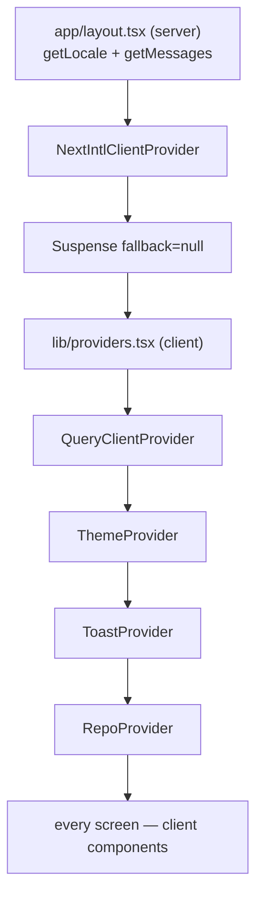

# client — UI architecture

How the web app is wired: rendering boundaries, providers, the data layer,
styling and translations. For what each screen must display see
[../specs/pages.md](../specs/pages.md).

## Rendering boundary

- Only four files render on the server: `src/app/layout.tsx:14` and the one-line
  wrappers `app/agents/page.tsx:5`, `app/settings/[section]/page.tsx:5`, plus the
  purely presentational `RunTraceDrawer/_components/atoms.tsx`. Every other file
  begins with `"use client"`.
- There is one layout; no nested layouts and no route groups.
- The theme is applied before paint by a script injected into `<head>`
  (`src/app/layout.tsx:21`, source in `src/lib/theme.tsx:44`), which is why
  `<html>` carries `suppressHydrationWarning`.

## Providers

`src/lib/providers.tsx:46` nests four providers in a fixed order.

- **QueryClient** (`providers.tsx:27`): `retry: 1`, `staleTime: 30_000`,
  `refetchOnWindowFocus: false`. A global `QueryCache.onError` toasts only
  network failures and 5xx (`providers.tsx:35`), while every mutation error
  toasts (`providers.tsx:41`). Do not add per-hook error toasts on top of this.
- **ThemeProvider** — `data-theme` on `<html>`, persisted locally.
- **ToastProvider** — the only notification surface.
- **RepoProvider** (`src/lib/repo-context.tsx:48`) resolves the active repo by
  priority: the `/repos/:id` segment, then `localStorage["dd-repo"]`, then the
  first repo. `useRepoNotFound()` gates the friendly empty state used by both
  repo-scoped pages.

## Application shell

`src/components/app-shell/AppShell.tsx:10` composes the frame, the command
palette and the shortcuts help, and installs three hooks:

- `useGlobalShortcuts` — `⌘K`, `?`, and `g`-then-key navigation with a 1200 ms
  window (`hooks/useGlobalShortcuts.ts:19`).
- `useShellCommands` — command palette entries.
- `useShellContext` — sidebar badge = number of PRs in `needs_review`
  (`hooks/useShellContext.ts:75`).

Navigation entries and shortcut definitions live in `src/vendor/ui/nav.ts`.

## Data layer

### Fetch wrapper

`src/lib/api.ts` is the only place `fetch` is called.

- Base URL from `NEXT_PUBLIC_API_BASE`, default `http://localhost:3001`
  (`api.ts:5`).
- `ApiError {status, code, details}` (`api.ts:8`); a network failure becomes
  status `0` with code `network_error` (`api.ts:36`); error bodies are unwrapped
  from `{error: {code, message, details}}` (`api.ts:48`); `204` yields
  `undefined` (`api.ts:61`).
- Exposes `api.get/post/put/patch/del`.

### Hooks

Every server interaction is a hook under `src/lib/hooks/`, grouped by area:
`core.ts` (settings, repos, pulls), `agents.ts`, `reviews.ts`, `trace.ts`,
`repo-intel.ts`, re-exported from `hooks/index.ts`.

Rules visible in the existing hooks:

- Query keys start with the resource: `["repos"]`, `["pulls", repoId]`,
  `["pull", prId]`, `["reviews", prId]`, `["pr-runs", prId]`,
  `["run-trace", runId]`.
- Mutations invalidate exactly the keys they affect — for example
  `useFindingAction` invalidates `["reviews", prId]` (`reviews.ts:139`).
- Polling is conditional, never unconditional: `usePulls` refetches every 60 s
  (`core.ts:102`), `usePrRuns` and `usePrActiveRuns` poll every 4 s only while a
  run is active (`reviews.ts:28`).
- Live run output is not React Query: `useRunEvents` opens an `EventSource` per
  run id and maps `info` / `tool` / `result` / `error` events, toasting on
  `error` (`reviews.ts:168`).

### Contracts

The Zod contracts are vendored at `src/vendor/shared/` and aliased as
`@devdigest/shared`. `src/lib/types.ts` re-exports **types only** — a runtime
import from that barrel breaks the Next build, which is why the feature-model
registry is mirrored in `src/lib/feature-models.ts:3`.

Shapes the UI depends on: `Severity` (`CRITICAL | WARNING | SUGGESTION`),
`Verdict`, `Finding` and `FindingRecord` (with `accepted_at` / `dismissed_at`),
`ReviewRecord`, `RunSummary` (with denormalised `score` and `blockers`),
`RunTrace` and `RunStats`, `PrMeta` and `PrDetail`.

## Styling

- Tokens are CSS custom properties in `src/vendor/ui/styles.css`, imported once
  through `src/app/globals.css:5`. Dark values are the defaults; light values
  override under `data-theme="light"`.
- Groups: surfaces (`--bg-primary`, `--bg-surface`, `--bg-elevated`,
  `--bg-hover`), borders, text (`--text-primary/-secondary/-muted`), accent,
  severity (`--crit`, `--warn`, `--sugg`, `--info`, each with a `-bg`), state
  (`--ok`, `--pending`, `--failed`, `--stale`), shadows and diff colours.
- Components never hardcode a colour. They map state to a token through a local
  constant map, for example `STATUS_META` on the PR list or `PROMPT_COLORS` in
  the trace drawer.
- Utility classes `mono` and `tnum` handle monospace and tabular numerals.
- Each component's `styles.ts` exports one object `s`. Variants are functions of
  state, which keeps conditional styling out of JSX.

## Internationalisation

- `next.config.mjs:3` registers the next-intl plugin; `src/i18n/request.ts:14`
  pins the locale to `en` and merges every `messages/en/*.json` file into one
  object keyed by filename, so a new feature adds a file instead of editing a
  shared one.
- Components call `useTranslations("<namespace>")`. Keys are dotted and scoped by
  area; status leaves keep the API's snake_case enum values
  (`list.status.needs_review`).
- ICU interpolation and plurals are both in use.
- Some newer components still contain hardcoded English — treat that as debt, not
  as precedent.

## Testing

- vitest with `environment: "jsdom"`, setup at `src/test/setup.ts` (jest-dom
  matchers and a `ResizeObserver` stub). No MSW and no global fetch mock.
- Tests sit next to the component. The standard shape is a local
  `renderWithIntl` helper wrapping `NextIntlClientProvider` with the **real**
  message JSON, so a missing translation key fails the test.
- Data hooks are replaced with `vi.mock` on the relative hook path; fixtures are
  typed with the shared contracts.
- Assertions are on user-visible text and on callbacks, plus targeted regression
  rules — for example the timeline must show `rejected`, not `done`, for a run
  with blockers (`RunHistory.test.tsx:46`).
- Theme coverage is done by rendering inside `
` for both
  themes.
- Real browser journeys belong in [`../e2e`](../../e2e/CLAUDE.md), not here.
