# reviewer-core — the review pipeline

What happens inside `reviewPullRequest` (`src/review/run.ts:123`). For the
guarantees this pipeline makes, see
[../specs/engine-contract.md](../specs/engine-contract.md).

```mermaid
flowchart LR
  IN["ReviewInput<br/>diff · system prompt · enrichment"] --> MODE["selectMode()"]
  MODE --> CH["chunks:<br/>single-pass → all files<br/>map-reduce → one per file"]
  CH --> ASM["assemblePrompt()<br/>system + user message"]
  ASM --> LLM["llm.completeStructured&lt;Review&gt;"]
  LLM --> PARSE["parseWithRepair()<br/>retry with reprompt"]
  PARSE --> RED["reduceReviews()"]
  RED --> GR["groundFindings()"]
  GR --> SC["scoreFromFindings(survivors)"]
  SC --> OUT["ReviewOutcome"]
```

## Inputs

`ReviewInput` (`src/review/run.ts:44`) takes the system prompt, the model id, the
`UnifiedDiff`, the `LLMProvider` and a set of optional slots: `strategy`,
`skills`, `memory`, `specs`, `callers`, `repoMap`, `prDescription`, `task`,
`maxRetries`, `mapThresholdLines`, `sessionId`, `onEvent`, `checkCancelled`.

`skills`, `memory` and `specs` are **resolved bodies**, not identifiers. The
engine never looks anything up.

`checkCancelled` throws to abort. The engine stays agnostic about the error type,
so the caller decides what cancellation means.

## Mode selection

`selectMode` (`src/review/run.ts:115`):

- `single-pass` — always one call.
- `map-reduce` — one call per file, but only when the diff has more than one file.
- `auto` (default) — map-reduce only when total changed lines exceed the
  threshold **and** the diff spans more than one file.

Defaults: `DEFAULT_MAP_THRESHOLD_LINES = 400`, `DEFAULT_REVIEW_MAX_RETRIES = 2`.

## Prompt assembly

`assemblePrompt` (`src/prompt.ts:85`) produces exactly two messages.

**System** = the agent's system prompt plus `INJECTION_GUARD`
(`src/prompt.ts:16`), which declares that everything inside `<untrusted>` is data
and that claims like "test fixture", "intentional" or "ignore this" — in any
language — never descope a review.

**User**, sections in this order, each omitted when empty:

| # | Section | Wrapped as untrusted |
|---|---|---|
| 1 | task line | no — it is our own instruction |
| 2 | `## PR description` | yes, `pr-description`, truncated at 4000 chars |
| 3 | `## Skills / rules` | no |
| 4 | `## Relevant memory` | no |
| 5 | `## Repo skeleton` | yes, `repo-map` |
| 6 | `## Project context` | yes, one wrapper per spec |
| 7 | `## Callers of changed symbols` | yes, `callers` |
| 8 | `## Diff to review` | yes, `diff` — always present, always last |

`wrapUntrusted` (`src/prompt.ts:30`) emits
`<untrusted source="LABEL">…</untrusted>` and neutralises any nested closing tag
inside the payload, so content cannot break out of the fence.

The function also returns a `PromptAssembly` record mirroring each slot, which is
what the trace drawer displays. Unused slots are `null`.

## LLM call

The engine calls only `llm.completeStructured<Review>({model, schema,
schemaName: 'Review', messages, maxRetries, sessionId?})`. It never constructs a
provider itself.

`OpenRouterProvider` (`src/llm/openrouter.ts:39`) is the concrete provider
shipped here, because the server and the CI runner both need it:

- built on the `openai` SDK pointed at an OpenAI-compatible base URL, default
  `https://openrouter.ai/api/v1`, 90-second timeout, temperature 0;
- structured output via `response_format: json_schema` with `strict: true`;
- OpenRouter-only extras: the session id in the body and `usage.include` so the
  real generation cost comes back;
- a 200 response with no choices throws rather than returning an empty review;
- `complete()` and `embed()` are intentionally unsupported.

### Retry with repair

For each attempt up to `maxRetries + 1`: parse the response; on failure, append
the model's raw text plus a generated reprompt message describing the schema
violation, and try again. Token counts accumulate across attempts, so a repaired
call reports the tokens it really spent. Exhausting the budget throws.

### Parsing

`src/llm/structured.ts`:

- `parseWithRepair` tries `JSON.parse` on the trimmed text **first**, because
  strict mode returns pure JSON and the brace scanner can be fooled by braces
  inside string values;
- `extractJson` is the fallback: strip code fences, else scan for the first
  balanced object or array;
- the result is validated with the shared `Review` Zod schema, and Zod issues are
  formatted into the reprompt message.

## Reduce

`reduceReviews` (`src/review/reduce.ts:43`) concatenates findings, joins
summaries, and takes the **worst** verdict by rank
(`request_changes > comment > approve`). A single partial short-circuits.

The mean score it computes is always overwritten afterwards — see below.

## Grounding and scoring

`groundFindings` (`src/grounding.ts:52`) runs once, after reduce, for every
strategy. A finding survives only if its file is in the diff and its line range
intersects the new-side lines of a hunk; the whole-file kinds `secret_leak`,
`lethal_trifecta`, `phantom` and `hook` need only the file to be present. Each
drop carries a reason and is emitted as an `info` event.

`scoreFromFindings` (`src/review/reduce.ts:27`) then recomputes the score from
the survivors: `100 − Σ penalty`, clamped to 0–100, with penalties CRITICAL 35,
WARNING 12, SUGGESTION 3. No findings means 100.

## Events

`onEvent` receives `{kind, msg, data?}` with kinds `info`, `tool`, `result`,
`error`: a mode banner, one `tool` event per chunk, a per-chunk candidate count,
the reduce result, one `info` per dropped finding, and a final grounding
summary. The server turns these into the live log and the persisted trace.

## Output

`ReviewOutcome` (`src/review/run.ts:95`) carries the grounded `review`, the
`grounding` string, the `dropped` list with reasons, the `mode`, the
`assembly`, the `chunks`, `tokensIn` / `tokensOut`, `costUsd` and the raw text.

## CI payload

`src/output/to-review.ts` builds the GitHub review event deterministically:
no findings → approve; the configured `failOn` threshold tripped → request
changes; otherwise comment. The model's verdict is ignored. Inline comments are
anchored to the in-diff line nearest the finding's end line; when no line can be
resolved the comment is dropped but the finding stays in the review body.
