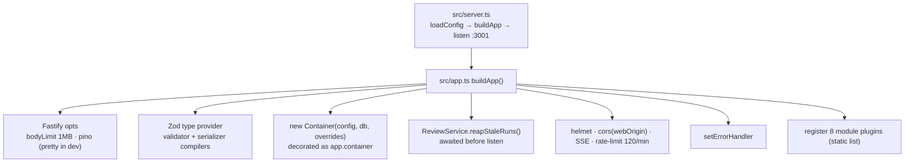

# server — architecture

How `@devdigest/api` is assembled: boot sequence, dependency injection, module
layering, adapters, data access. For the behaviour of a review run see
[../specs/review-flow.md](../specs/review-flow.md).

## Boot sequence



- `src/server.ts:6` builds and listens on `0.0.0.0:<API_PORT>`; SIGTERM/SIGINT
  close once, guarded by a `closing` flag (`src/server.ts:12`).
- `buildApp` (`src/app.ts:41`) is exported so tests drive the API through
  `app.inject()` with no port and no Docker.
- Rate limiting is skipped when `NODE_ENV === 'test'` (`src/app.ts:95`), so tests
  never hit 429.
- Health lives in the app file, not in a module: `GET /health` (rate-limit off,
  `src/app.ts:100`) and `GET /health/ready`, which runs `select 1` and answers
  503 when the DB is unreachable (`src/app.ts:104`).
- Stale-run reaping runs before the port opens (`src/app.ts:80`): every row still
  marked `running` from a previous process is failed. This assumes a single API
  instance per database, as the comment at `src/app.ts:78` states.
- Modules are registered from a static object (`src/modules/index.ts:24`).
  `@fastify/autoload` is a dependency but deliberately unused, because dynamic
  `import()` of `.ts` is not portable across tsx, bundler and vitest
  (`src/modules/index.ts:17`).

## Configuration

`loadConfig(env)` (`src/platform/config.ts:64`) parses `process.env` with a Zod
`EnvSchema` and derives the rest:

| Value | Default | Source |
|---|---|---|
| `cloneDir` | `~/.devdigest/workspace`, resolved absolute | `config.ts:66` |
| `secretsPath` | `~/.devdigest/secrets.json` | `config.ts:74` |
| `logLevel` | `silent` under test, else `info` | `config.ts:76` |
| `webOrigin` | `http://localhost:${WEB_PORT}` | `config.ts:77` |
| `embeddingsEnabled` | `false` — zero OpenAI traffic by default | `config.ts:78` |
| `repoIntelEnabled` | `true` unless explicitly `false` | `config.ts:79` |

Secret keys are intentionally absent from the schema (`config.ts:9`); they are
resolved at call time through the secrets provider.

## Dependency injection

`Container` (`src/platform/container.ts:56`) is the composition root. One
instance per app, decorated onto Fastify at `src/app.ts:67`.

- **Eager:** `config`, `db`, `secrets`, `auth`, `runBus` (the module-level SSE
  singleton from `src/platform/sse.ts:103`), `jobs`.
- **Lazy, memoised with `??=`:** `git`, `agentsRepo`, `reviewRepo`, `codeIndex`,
  `repoIntel`, `depgraph`, `tokenizer`, `priceBook`. Shared repositories are
  built here so modules never reach into each other's data layer
  (`container.ts:70`).
- **Async resolvers:** `github()` throws `ConfigError` when `GITHUB_TOKEN` is
  missing (`container.ts:156`); `llm(id)` caches per provider id and builds
  `openai`, `anthropic` or the `openrouter` provider that lives in reviewer-core
  (`container.ts:173`); `embedder()` refuses before constructing a client when
  embeddings are disabled (`container.ts:201`).
- **Test seam:** `ContainerOverrides` (`container.ts:40`) lets a test replace any
  adapter; the fakes live in `src/adapters/mocks.ts`.
- After a key is saved, `invalidateSecretCaches()` clears the LLM, GitHub and
  embedder caches (`container.ts:214`, called from `src/modules/settings/routes.ts:84`).

### Pricing

`PriceBook` (`src/platform/price-book.ts:21`) caches per-model USD-per-million
prices with a six-hour TTL and refreshes lazily without blocking. `estimate()`
is synchronous on purpose (`price-book.ts:16`) because it is handed to the
OpenRouter provider as a hook that cannot await. The provider is constructed
with that hook at `container.ts:185`.

## Secrets

Secrets never touch the database. `LocalSecretsProvider`
(`src/adapters/secrets/local.ts:16`) is the single chokepoint:

- reads `~/.devdigest/secrets.json`, caches in memory (`local.ts:24`);
- `get()` prefers the stored value and falls back to `process.env`, with
  `GITHUB_PAT` accepted as a legacy alias for `GITHUB_TOKEN` (`local.ts:37`);
- `set()` writes with mode `0600` (`local.ts:44`).

The `settings` table is documented as non-secret preferences only
(`src/db/schema/core.ts:33`). What does come from it is the per-feature model
override resolved by `src/modules/settings/feature-models.ts:36`.

## Module layering

Eight domains under `src/modules/`: `settings`, `repos`, `pulls`, `polling`,
`workspace`, `agents`, `reviews`, `repo-intel`.

```
routes.ts      transport only — schema, auth context, delegate
  └ service.ts business logic, orchestration
      └ repository.ts   the only place SQL is written
          └ helpers.ts  pure transforms, no side effects
             constants.ts literals
```

The rule is stated in code at `src/modules/repos/service.ts:17`. Thin modules
skip layers — `polling` and `workspace` query `container.db` directly, `settings`
has no service. The `reviews` module goes the other way and splits its data layer
into `repository/{pull,review,run}.repo.ts` behind a composing `ReviewRepository`
facade (`src/modules/reviews/repository.ts:25`).

Every route resolves tenancy through `getContext(container, req)`
(`src/modules/_shared/context.ts:14`), which returns `{workspaceId, userId}`.
This is why workspace scoping is never forgotten in a query.

## Error handling

One handler, four branches, registered before the modules
(`src/app.ts:116`):

1. Zod type-provider validation errors → **422** `validation_error` with details.
2. Response serialization failures → logged, generic **500**, nothing leaked.
3. Duck-typed `ZodError` (matched by name plus an issues array, so it survives
   duplicate zod instances) → **422**.
4. `AppError` → its own status and `{code, message, details}`; anything else →
   `statusCode ?? 500`.

The envelope matches `ApiErrorBody` in the shared contracts
(`src/vendor/shared/contracts/platform.ts:266`).

## Adapters

`src/adapters/*` implement the interfaces declared in
`src/vendor/shared/adapters.ts`: `LLMProvider`, `Embedder`, `GitHubClient`,
`GitClient`, `CodeIndex`, `AuthProvider`, `SecretsProvider`.

| Adapter | Implementation |
|---|---|
| LLM | `llm/openai.ts`, `llm/anthropic.ts`, `llm/pricing.ts`; OpenRouter lives in reviewer-core and is reused here (`container.ts:180`) |
| GitHub | `github/octokit.ts` |
| Git | `git/simple-git.ts`, `git/diff-parser.ts` |
| Code index | `codeindex/ripgrep.ts`, `codeindex/extract.ts` |
| Static analysis | `astgrep/index.ts`, `depgraph/index.ts` |
| Tokenizer | `tokenizer/index.ts` (js-tiktoken, used for the repo-map budget) |
| Secrets / auth | `secrets/local.ts`, `auth/local.ts` |
| Test doubles | `mocks.ts` |

## Data access

- `createDb(url, {max})` wraps postgres-js, pool of 10 by default
  (`src/db/client.ts:17`).
- Schema is one file per domain under `src/db/schema/`, re-exported by
  `src/db/schema.ts`. Every domain table carries `workspace_id`.
- Row types are centralised in `src/db/rows.ts` so consumers never import another
  module's data layer.
- Migrations are applied by `runMigrations` (`src/db/migrate.ts:19`), which first
  ensures the `vector` extension exists. They are never applied on boot.

Key tables for the review path:

| Table | Notable columns |
|---|---|
| `repos` | `full_name`, `default_branch`, `clone_path`; unique per `(workspace_id, full_name)` |
| `pull_requests` | `number`, `head_sha`, `last_reviewed_sha`, `status`, `additions`, `deletions`; unique per `(repo_id, number)` |
| `pr_files` | `path`, `patch` — the fallback source when a real git diff is unavailable |
| `agent_runs` | `provider`, `model`, `duration_ms`, `tokens_in`, `tokens_out`, `status`, `source`, `findings_count`, `grounding`, `score`, `blockers` |
| `run_traces` | primary key `run_id`, one `jsonb` document per run, cascade delete |
| `reviews` | `verdict`, `summary`, `score`, `model`, `run_id` (no FK) |
| `findings` | `file`, `start_line`, `end_line`, `severity`, `category`, `confidence`, `accepted_at`, `dismissed_at` |

`agent_runs` has no cost column: migration `0009_complex_runaways.sql` dropped
`cost_usd`. `ci_runs` and `eval_runs` still carry theirs
(`src/db/schema/ci.ts:23`, `src/db/schema/eval.ts:34`).

## Streaming and run control

`RunBus` (`src/platform/sse.ts:19`) keeps a per-run buffer with a monotonic
sequence number. `subscribe` replays the buffer before attaching
(`sse.ts:63`), `complete` emits `done` and drops the emitter while keeping the
buffer (`sse.ts:76`), and `onDone` fires immediately for runs that already
finished so a late subscriber never hangs (`sse.ts:90`).

`RunLogger` (`src/platform/run-logger.ts:36`) is the single sink for run output:
it fans out to the bus, to the buffer that becomes the persisted trace, and to
pino.

## Testing

- `vitest.config.ts` mirrors the two tsconfig aliases and sets 120-second
  timeouts because testcontainers is slow to start Postgres.
- `*.it.test.ts` uses `startPg()` (`test/helpers/pg.ts:35`), which boots
  `pgvector/pgvector:pg16`, runs the real migrations and returns a live handle.
  `dockerAvailable()` memoises a `docker info` probe so the suites skip cleanly
  on a machine without Docker.
- Everything else is hermetic: build the app with `buildApp({config, overrides})`
  and drive it with `app.inject()` (`test/routes-smoke.test.ts:14`).
- Config in tests is always forced through `loadConfig({...process.env,
  NODE_ENV: 'test'})`, which silences logs and disables the rate limit.
